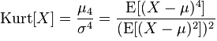

## Kurtosis
#### February 25, 2016

Kurtosis is the measure of "tailedness" of the probability distribution of a real-valued random variable. It is similar to skewness. It can be an useful measure of whether there is a problem in a sample due to outliers.

