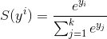

# Softmax function
Softmax function "squashes" *k-dimensional* vector *y* of arbitrary values into another *k-dimensional* vector *z* whose values are in the range (0, 1) and they add up to 1. It converts classification scores to probabilities.

